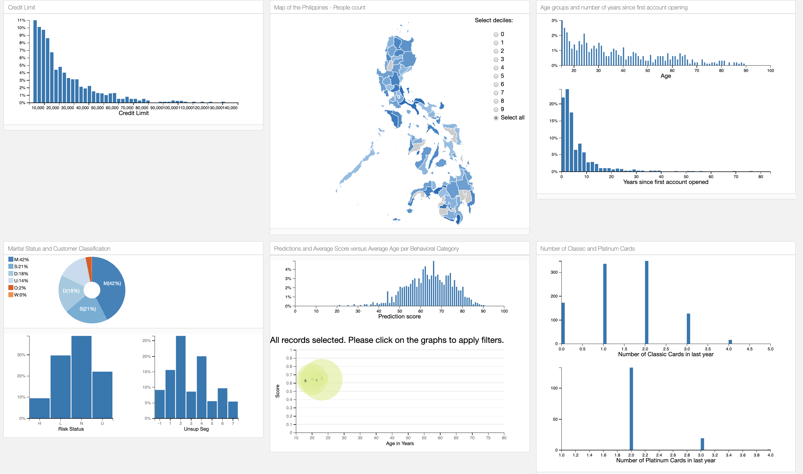

# Interactive dashboard



This repository deploys an app to explore a dataset using interactive visualizations.
The backend uses Python with `Flask`, while the data filtering and visualization
capabilities are handled by `crossfilter.js` and `dc.js` respectively. The dashboard itself is
built from a [keen.io](https://github.com/keen/dashboards) template.

The dashboard is able to seamlessly handle more than 800,000 rows (customers) for about 20 columns (attributes).

This project has been implemented using `Python 3.7.0`.

## Installation

Clone and go to the repository
```
git clone https://github.com/doulouUS/EDA_Dashboard_App.git
cd path/to/repo
```

Create your local python environment using `virtualenv`
```
virtualenv -p python3 venv
```

Activate it (`. venv/bin/activate`) and install the dependencies
```
pip install -r requirements.txt
```

Fire the application and go to your browser on [http://0.0.0.0:5000/](http://0.0.0.0:5000/)
```
python run_flask_app.py
```

## Quick setup using Docker

Pull from Docker hub
```
docker pull doulou74/dashboard_viewer:0.1
```

Run the image locally on port 5000
```
docker run --rm -d -p 5000:5000/tcp doulou74/dashboard_viewer:0.1
```
